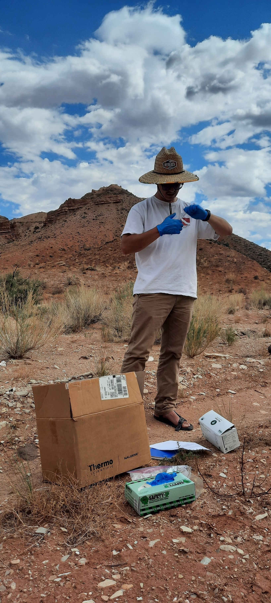
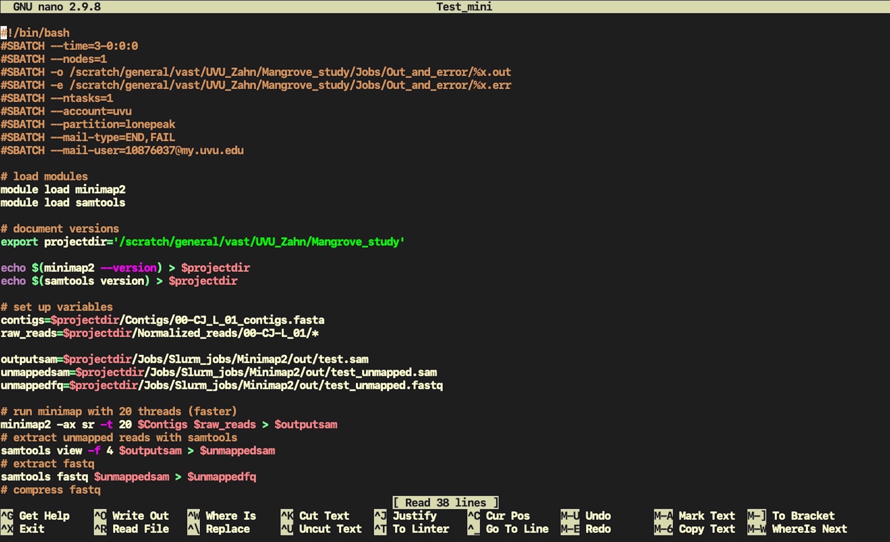
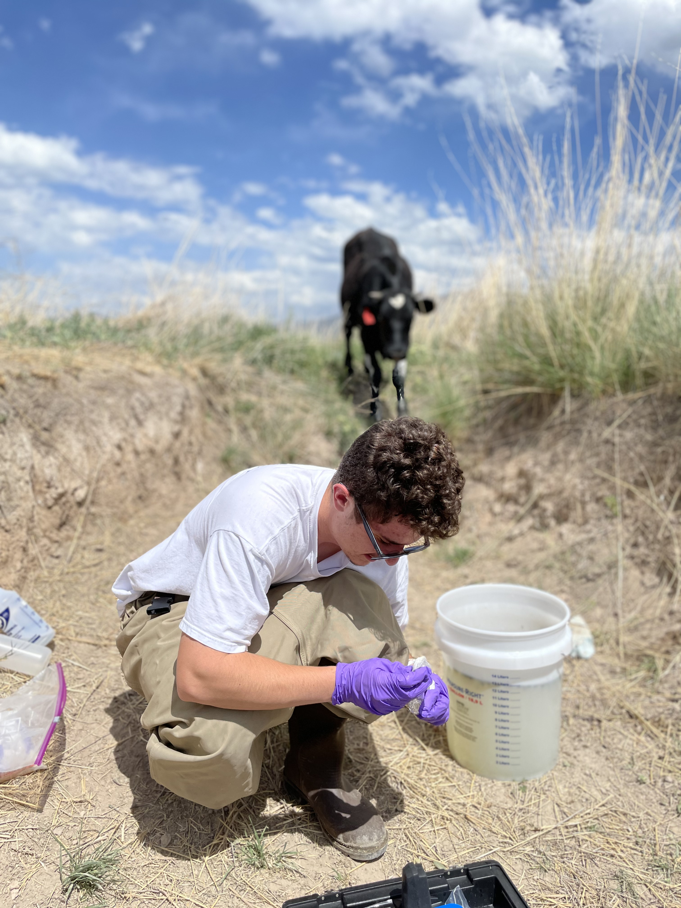

<html>
<head>
```{r setup, include=FALSE}
knitr::opts_chunk$set(echo = TRUE, warning = FALSE, message = FALSE)

library(tidyverse)
```
<style type="text/css">
.main-container {
  max-width: 1800px;
  margin-left: auto;
  margin-right: auto;
}
</style>

<style>
  body {background-color:#d6c0a8;}
</style> 

<style>
div.white {background-color:#ffffff;}
</style>

<style>
h1 {color: black;
    font-size: 200%}
p  {color: black;
    font-size: 125%}
a {font-size: 115%}
a:link {
  color: #ffffff;
  background-color: transparent;
  text-decoration: none;
}
a:visited {
  color: #ffffff;
  background-color: transparent;
  text-decoration: none;
}
a:hover {
  color: coral;
  background-color: transparent;
  text-decoration: underline;
}
a:active {
  color: coral;
  background-color: transparent;
  text-decoration: underline;
  font-size: 125%;
}
ul {
  list-style-type: none;
  margin: 0;
  padding: 0;
  overflow: hidden;
  background-color: #36454F;
  position: fixed;
  top: 0;
  width: 100%;
}

li {
  float: left;
  border-right: 1px solid #ffffff;
}

li:last-child {
  border-right: none;
}

li a {
  display: block;
  color: white;
  text-align: center;
  padding: 14px 16px;
  text-decoration: none;
}

li a:hover {
  background-color: #111;
}
.active {
  background-color: #04AA6D;
}
</style>

<ul>
  <li><a href="http://JLEON123.github.io">Homepage</a></li>
  <li><a href="http://JLEON123.github.io/portfolio/">Data Analytics</a></li>
  <li><a href="http://JLEON123.github.io/Research/">Research</a></li>
  <li><a href="http://JLEON123.github.io">Conferences</a></li>
  <li><a href="http://JLEON123.github.io">Publications</a></li>
  <li><a href="http://JLEON123.github.io">CV</a></li>
</ul>

</head>

___

<body>

<br>

<h1>
<b>Research at UVU</b>
</h1>  

<p>
<b> Climate Change & Invasive Plants </b>  

The climate of the American Southwest is rapidly changing relative to other areas in the United States. Temperatures are predicted to increase by roughly 10° F (5.5° C) by the year 2100. Drought events are expected to increase in intensity and length as well. Understanding how plant communities in this region will react to these changes is an important area of research in Capitol Reef National Park (CARE). Research has provided insight into how some native species will react, for example, junipers killing off their branches under drought conditions.  However, few research studies have examined how climate change will affect invasive species. This research examines an invasive plant in CARE under a variety of climate projections. We are also interested in the microbiome of the invasive plant to see if it influences the plant’s response to climate disturbances. This research aims to provide new insights into how invasive plants are successful under disturbed conditions. The species of interest for our research is the African mustard, *Strigosella africana*.  Of the 126 listed invasive species in CARE, the African mustard is one of 12 species that is actively controlled because of the threat it poses to native communities.  First, we examined whether increased heat, drought conditions, and/or fertilizer affected plant survivability.  We found significant differences in plant survivability under differing heat and/or whether a drought was applied.  Next, to find a base ‘natural’ microbiome, we collected full plant samples in CARE using sterile techniques, separated them by shoots/roots, and sequenced their DNA. Plants grown from seeds collected in CARE were examined under the same climate models, excluding fertilizer, as described above. DNA sequenced from plants that survived these trials will then be compared to the natural microbiome to spot any differences in community and/or composition.
</p>

<br>

___

<p>
<b>  Mangrove Metagenom Pipleine: Current metagenome pipelines perform poorly in understudied environments </b>  

- **Genome assembly** is the process of transforming raw sequence reads into complete or near-complete contiguous sequences (contigs) called genomes.  
- **Genome annotation** analyzes contigs to identify protein-coding regions, describe them, and link them to taxonomic classifications. This data is often used to answer evolutionary and genetic questions.  
In this research, we are looking at samples of *Sonneratia alba*, a mangrove species. Samples were collected from the plants leaves, pneumatophores, and the surrounding sediment. The study area are islands surrounding both Singapore and Malaysia. This study is still in progress but we have tested several well known assembly, binning, and annotation programs. The programs that have been successful include the tools from the bbtools program to trim adapters as well as mapping and normalizing the reads. MetaSPAdes was successful in creating the contigs for the reads. Bakta and MetaEUK are being tested to annotate bacterial and fungal genomes, respectivley. The most notable unnsuccessful program we used was MetaWRAP.
</p>

<br>

___

<p>
<b> Utah Lake Eutrophication Study </b>  
<b> *Field Sampling* </b>  

Harmful algal blooms (HABs) are a common problem for water bodies that affects aquatic life, community health, and recreation. Excessive phosphorus (P) and nitrogen (N) input to aquatic ecosystems often cause HABs. Utah Lake, one of largest freshwater lakes in the western United States, experiences seasonal HABs. Utah Lake is considered hypereutrophic due to nutrient input from agricultural and stormwater runoff, atmospheric deposition (rain and dust), effluent from wastewater treatment plants (WWTPs), etc. This research focused on the nutrient loads from eighteen sites (both upstream and downstream) of ten Utah Lake tributaries and seven WWTPs. Water samples were tested over a six-week period using a CheMetrics V-2000 Photometer to determine the concentrations (mg/L) of four inorganic compounds: orthophosphate (PO43+), nitrate (NO3-), nitrite (NO2-), and ammonia (NH3). A YSIDSS Pro water quality meter was used to measure other water parameters (pH, chlorophyll a, phycocyanin, etc.). Our data showed temporal and spatial variations in nutrient concentrations. Downstream river sites had higher 6-week average concentrations (NH3:0.87, NO3- :3.28, NO2- :0.15, and PO43+ :1.41) than the upstream sites (NH3:0.09 , NO3- :0.62, NO2- :0.04, and PO43+:0.23) for all tributaries. The WWTPs had much higher average concentrations when compared to the tributaries (NH3:2.10, NO3- :42.11, NO2- :0.33, and PO43+:6.50). A limit for P was set at 1 mg/L for the WWTPs on January 1st, 2020, by the Utah Division of Water Quality. Based on our data five of the seven WWTPs exceeded this limit but were allowed because of individual extensions. Each WWTP has their own limit for NH3 which they all complied to. However, there is no limit for NO3- and NO2- at the WWTPs. Our results indicated that the failure to abide by the P limit and a lack of limits on total inorganic nitrogen could have resulted in much higher nutrient input to Utah Lake from the WWTPs than previously thought. To minimize HABs, a stricter nutrient standard should be placed on the effluent from the WWTPs, which could be achieved by investment in wastewater treatment technology. Also, improved farming practices (such as crop rotation and efficient irrigation techniques) could help decrease nutrient runoff from agricultural land into the tributaries and the lake.  

<br>

<b> *Remote Sensing* </b>  

Phosphorus and nitrogen are essential nutrients to healthy ecosystems. However, excess amounts trigger frequent harmful algal blooms (HABs) in aquatic ecosystems. The study area is Utah Lake and its watershed, in Utah. This study aims to classify the green areas in urban and natural settings within the Utah Lake watershed and quantify how much nutrient is entering Utah Lake from each categorized green area. The urban areas are classified into the following categories local parks, golf courses, and parcels (residential areas). Natural areas are classified into the following categories: deciduous Forests, conifer forests, cultivated land, pasture, and herbaceous. For the urban areas, Google Licensed Imagery data (~15 cm spatial resolution) from 2019 for the entire watershed was obtained using the Utah Geospatial Resource Center (UGRC). A green vegetation index was used to extract urban vegetation in the watershed, this unique approach used only the green and red bands which differs from common NDVI equations that usually utilize a near-infrared (NIR) band. To collect data for nutrient loading on agricultural land covers, data was collected from NLCD USDA 2019 (National Land Cover Database for United States Department of Agriculture). Then the total area for each land cover classification could be calculated for the Utah Lake watershed. The totals for the different land covers are: Cultivated land 348.67 km², Deciduous 1,946.56 km², Pasture 184.05 km², Herbaceous 805.70 km², Mixed Forest 40.84 km², and Evergreen Forest 2,600.51 km².


