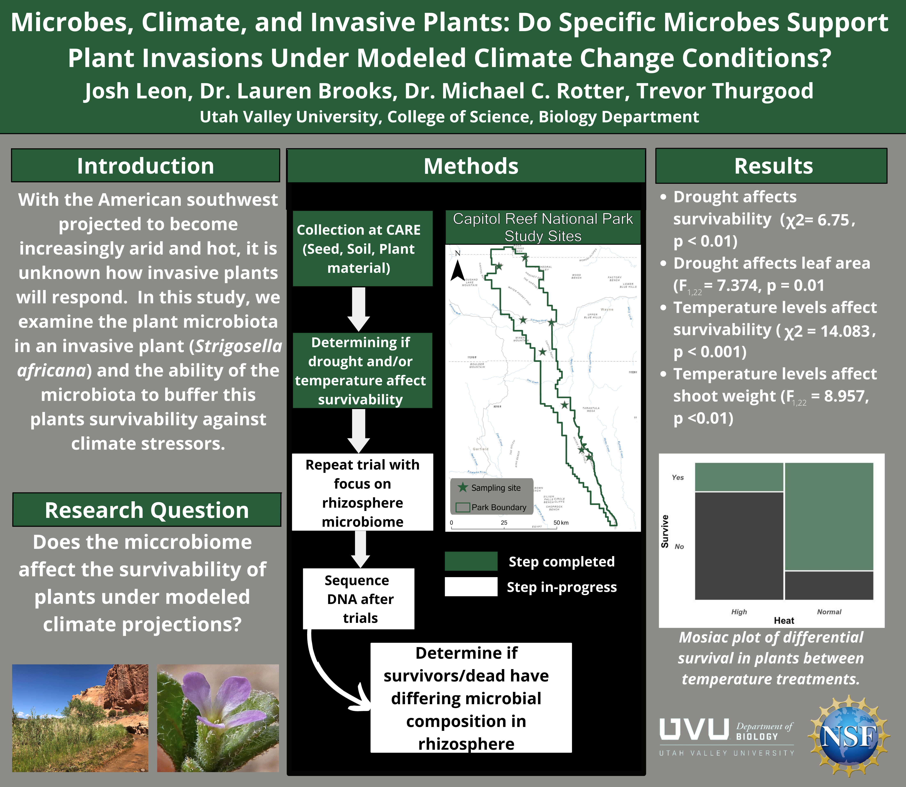

```{r setup, include=FALSE}
knitr::opts_chunk$set(echo = FALSE)
library(kableExtra)
library(tidyverse)
library(ggmosaic)
library(patchwork)
```

# **Abstract**  

Anthropogenic climate change has caused the Earth’s temperature to rise by roughly 1 degree Celsius compared to pre-industrial temperatures (IPCC, 2018; Lindsey & Dahlman, 2023).  How this affects organisms like plants depends on the region of interest. The region of interest for this study is the Southwestern United States where drought events, driven by arid conditions and high temperatures, are expected to increase in intensity and length (Cook et al., 2015). Understanding the response patterns exhibited by plant communities in this region is imperative in formulating strategies to effectively bolster the resilience of the ecosystem under these conditions. All plants will be affected by climate change, but the ecosystem's disturbances will likely favor invasive plant species over native plant species (Turbelin & Catford, 2021). For this study, I used the African mustard (Strigosella africana), an extremely invasive plant in this region. I am interested in the plant's microbiome (the entirety of the microbes associated with the plant) and its response patterns to the projected changes in the climate. I hypothesized that plants that withstand the simulated climate change trials will exhibit a bacterial community structure similar to that of other surviving plants, yet distinguishable from the naturally occurring microbiome.

# **Presentations**  

## Utah Conference for Undergraduate Research (UCUR) 2022  

```{r, include=TRUE, fig.align="center", out.width="100%", out.height="100%", echo=FALSE}

```

## Botanical Society of America's 2023 Conference & NSF S-STEM 2023 Conference

```{r, include=TRUE, fig.align="center", out.width="100%", out.height="100%", echo=FALSE}
knitr::include_graphics("./presentations/S_Stem_project/JL_Final_Draft_Botany.png")
```
 <br> 
 
# **Methods** 
<p>

* Collected plant samples, seeds, and soil in Capitol Reef National Park (CARE).  
* Grew replicates of the African Mustard in the UVU greenhouses.  
* Extracted, quantified and sequenced the DNA from the plant and soil samples using Oxford Nanopore Technology.  
* Utilized growth chambers to conduct 6-week trials using a randomized block design (n=48).  
&emsp; - 24 plants were placed into one growth chamber that mimicked 2021 temperatures for the CARE region. The remaining plants (n = 24) were placed into a growth chamber that simulated projected 2100 temperatures for the region using the C6-C7 scenario from the Intergovernmental Panel on Climate Change’s (IPCC) 6th annual report which predicts a temperature increase of 3 degrees Celsius (IPCC, 2022).
</p>

# **Results**  

## Abiotic Impacts  

As expected, increased temperatures and decreased precipitation lowered plant health and survival rates. Fertilizer did not significantly affect plant health.

```{r, include=TRUE}
# Load in data
Abiotic_results <- read_csv("./data/S_Stem_project/Abiotic_stress_data.csv")

# Factor to allow for chiSquared
Abiotic_results$Precipitation <- 
  factor(Abiotic_results$Precipitation, levels = c("Normal", "Decreased"))

Abiotic_results$Temperature <- factor(Abiotic_results$Temperature)
Abiotic_results$Status <- factor(Abiotic_results$Status)
Abiotic_results$Fertilzer <- factor(Abiotic_results$Fertilzer)

# Show temperature difference and its affect on plant health
Temp_Mosiac <- 
  Abiotic_results %>%
  ggplot() +
  geom_mosaic(aes(x = product(Status, Temperature)),
              fill=c("#275d38", "#000000", "#275d38", "#000000")) +
  theme_minimal() +
  theme(
    axis.title.x = element_text(face = "bold", size = 20),
    axis.title.y = element_blank(),
    axis.text = element_text(face = "bold.italic", size = 12),
    panel.grid.major.x = element_blank(),
    panel.grid.minor.x = element_blank(),
    panel.grid.major.y = element_blank(),
    panel.grid.minor.y = element_blank() 
  )

# Show precipitation difference and its affect on plant health

Precip_Mosiac <- 
  Abiotic_results %>%
  ggplot() +
  geom_mosaic(aes(x = product(Status, Precipitation)),
              fill=c("#275d38", "#000000", "#275d38", "#000000")) +
  theme_minimal() +
  theme(
    axis.title.x = element_text(face = "bold", size = 20),
    axis.text.x = element_text(face = "bold.italic", size = 12),
    axis.title.y = element_blank(),
    axis.text.y = element_blank(),
    panel.grid.major.x = element_blank(),
    panel.grid.minor.x = element_blank(),
    panel.grid.major.y = element_blank(),
    panel.grid.minor.y = element_blank() 
  )

# Fertilizer had no affect
Fert_Mosiac <- 
  Abiotic_results %>%
  ggplot() +
  geom_mosaic(aes(x = product(Status, Fertilzer)),
              fill=c("#275d38", "#000000", "#275d38", "#000000")) +
  theme_minimal() +
  theme(
    axis.title.x = element_text(face = "bold", size = 20),
    axis.text.x = element_text(face = "bold.italic", size = 12),
    axis.title.y = element_blank(),
    axis.text.y = element_blank(),
    panel.grid.major.x = element_blank(),
    panel.grid.minor.x = element_blank(),
    panel.grid.major.y = element_blank(),
    panel.grid.minor.y = element_blank() 
  )

Temp_Mosiac + Precip_Mosiac + Fert_Mosiac

attach(Abiotic_results)
PrecipChi <- chisq.test(Status, Precipitation)
TempChi <- chisq.test(Status, Temperature)
FertChi <- chisq.test(Status, Fertilzer)
detach(Abiotic_results)

TempChi
PrecipChi
FertChi
```

## Community Composition  

When analyzing the DNA data, I modified scripts found <a style="font-size:100%;"href="https://github.com/gzahn/Microbiome_Workshop" target = "_blank">here</a> and created new scripts for additional information. All of my data and additional scripts can be found <a style="font-size:100%; "href="https://github.com/JLEON123/Strigosella_Research" target = "_blank">here</a>. All data was analyzed in R version 4.1.1.

### *Script: 00_Remove_Primers.R*

```{r, programtable}
versions00 <- read.csv("./data/S_Stem_project/program_metadata/00_versions.csv")

versions00 %>% 
  kable() %>% 
  kable_classic(lightable_options = "hover")
```

