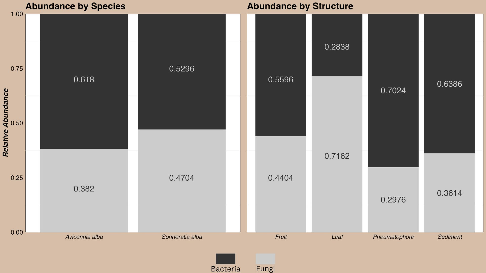

<style type="text/css">
.main-container {
  max-width: 1800px;
  margin-left: auto;
  margin-right: auto;
}
</style>

<style>
    body { background-color: #333333; }
</style>

<style>
div.brown { text-align:center; background-color:#a89d82; border-radius: 10px; padding: 10px;}
</style>
<div class = "brown">

## [Home](http://JLEON123.github.io) | [About Me](https://JLEON123.github.io/aboutme/index.html) | [Portfolio](http://JLEON123.github.io/portfolio/index.html)

</div>

<br>

<style>
div.white { color:#000000; background-color:#ffffff; border-radius: 20px; padding: 20px;}
</style>
<div class = "white">


# **Analyzing the Microbiome of Mangrove Samples**  
___


```{r setup, include=FALSE}
knitr::opts_chunk$set(echo = TRUE, warning = FALSE, message = FALSE)
library(tidyverse); packageVersion("tidyverse")
library(dada2); packageVersion("dada2")
library(purrr); packageVersion("purrr")
library(Biostrings); packageVersion("Biostrings")
library(ShortRead); packageVersion("ShortRead")
library(sp); packageVersion("sp")
library(sf)
library(maps)
library(patchwork)
library(rnaturalearth)
library(rnaturalearthdata)
library(ggmap)
library(kableExtra)
library(hrbrthemes)
Library <- c("tidyverse", "dada2", "purrr", "Biostrings", "ShortRead")
Version <- c('1.3.2', '1.20.0', '0.3.5', '2.60.2', '1.50.0')
Lib_versions <- data.frame(Library, Version)
theme_set(theme_minimal())
```

## __Introduction__
write some random bs here

___

### *Libraries Used*
```{r, echo=FALSE}
Lib_versions %>% kable() %>% kable_minimal(lightable_options = 'striped')
```

### *Input Data*
Metadata for the samples was retrieved from this [github repository](https://github.com/gzahn/SE_Asia_Mangrove_Bacteria). The data was joined and cleaned to make the following data frame that provided geographic information as well as information about the collected sample.
```{r}
# Reading in data
Df <- readRDS('./data/bact_and_fungi_clean_ps_object')

# Sub-setting the sam_data
sam_data <- Df@sam_data %>% 
  as('data.frame') %>% 
  select(Host, Structure, Microbe, geo_loc_name, Location, Lat, Lon) %>% 
  filter(!is.na(Lat),
         !is.na(Lon))

# Sub-setting the OTU and Tax tables
otu <- Df@otu_table@.Data
tax <- Df@tax_table@.Data

# Changing the row names to a column
sam_data <- tibble::rownames_to_column(sam_data, "SampleID") %>% as_tibble()

otu <- as.data.frame(otu)
otu <- tibble::rownames_to_column(otu, "SampleID") %>% as_tibble()

tax <- as.data.frame(tax)
tax <- tibble::rownames_to_column(tax, "Read") %>% as_tibble()

# Combing the OTU table reads into one column and their counts into another
otu <- otu %>% 
  pivot_longer(cols = -'SampleID',
               names_to = 'Read',
               values_to = 'Count')

# Joining the tax and otu tables and then joining that table to the sam_data table
tax_otu <- full_join(tax, otu)
full <- full_join(tax_otu, sam_data)

# Removing the blanks
full <- full %>% 
  filter(Structure != 'Blank')

# Sub-setting the full data to display
full_glimpse1 <- 
  full %>% 
  select(SampleID, Host, Location, Structure, Kingdom, Lat, Lon) %>% 
  head(100)
full_glimpse2 <- 
  full %>% 
  select(SampleID, Host, Location, Structure, Kingdom, Lat, Lon) %>% 
  tail(100)
full_show <- full_join(full_glimpse1, full_glimpse2)

full_show %>% kable() %>% 
  kable_minimal(lightable_options = 'hover') %>% 
  scroll_box(width = "800px", height = "400px")
```

### *Study Area*
The mangrove samples were taken from areas in south-east Asia. The locations in Singapore are shown in the map on the left and the locations in Malaysia are shown in the map on the right.

<div class = "brown">

```{r, include=FALSE}

# Getting just the geo-spatial data
loc_table <- sam_data %>% 
  select(c(geo_loc_name,Location,Lon, Lat))

# Filling the cells with empty values to the correct country.
S_Location <- c("Kranji", "Lim Chu Kang", "Semakau", "Chek Jawa")
loc_table <- loc_table %>% 
  mutate(Country = geo_loc_name,
         .keep = "unused",
         .before = 1) %>% 
  mutate(Country = if_else(loc_table$Location %in% S_Location, "Singapore", "Malaysia"))

# Converting the country and location to factors
loc_table$Location <- as.factor(loc_table$Location)
loc_table$Country <- as.factor(loc_table$Country)

# Getting just the individual points for the locations in Singapore
S_loc_table <- loc_table %>% 
  filter(Country == "Singapore")
S_loc_table <- S_loc_table %>% 
  unique()

S_loc_table$Lon <- as.character(S_loc_table$Lon)
S_loc_table <- S_loc_table %>% filter(Lon != 103.767778)
S_loc_table$Lon <- as.numeric(S_loc_table$Lon)
S_loc_table$Location <- factor(S_loc_table$Location, levels = c("Lim Chu Kang", "Kranji", "Chek Jawa", "Semakau"))

# Getting just the individual points for the locations in Malaysia
M_loc_table <- loc_table %>% 
  filter(Country != "Singapore")
M_loc_table <- M_loc_table %>% 
  unique()

M_loc_table$Lon <- as.character(M_loc_table$Lon)
M_loc_table <- M_loc_table %>% filter(Lon != 103.991095)
M_loc_table$Lon <- as.numeric(M_loc_table$Lon)
M_loc_table$Location <- factor(M_loc_table$Location, levels = c("Langkawi", "Tok Bali", "Redang", "Merang", "Port Dickson", "Tioman"))
```

```{r, echo=FALSE}
map_singapore <- 
  ggmap(get_stamenmap(bbox = c(103.5,1.1,104.1,1.5), 
                      zoom = 12, 
                      maptype = 'terrain-background')) +
  geom_point(data = S_loc_table,
             aes(x = Lon, y = Lat, fill = Location), 
             size = 3, 
             shape = 21) +
  scale_fill_grey(start = 1, end = 0) +
  theme_bw() +
  theme(legend.position = 'bottom',
        legend.title = element_blank(),
        legend.text = element_text(size = 10),
        axis.title = element_text(size = 10), 
        axis.text = element_text(size = 8),
        plot.background = element_rect(fill = '#a89d82', color = '#a89d82'),
        legend.key.size = unit(.25, "cm"),
        legend.background = element_rect(fill = '#a89d82'),
        legend.key = element_rect(fill = '#a89d82')) +
  labs(x = 'Longitude',
       y = 'Latitude')

map_malaysia <- 
  ggmap(get_stamenmap(bbox = c(99.7,1.0,104.5,6.75), 
                      zoom = 8, 
                      maptype = 'terrain-background')) +
  geom_point(data = M_loc_table,
             aes(x = Lon, y = Lat, fill = Location), 
             size = 3, 
             shape = 21) +
  scale_fill_grey(start = 1, end = 0) +
  theme_bw() +
  theme(legend.position = 'bottom',
        legend.title = element_blank(),
        legend.text = element_text(size = 10),
        axis.title = element_text(size = 10), 
        axis.text = element_text(size = 8),
        plot.background = element_rect(fill = '#a89d82', color = '#a89d82'),
        legend.key.size = unit(.25, "cm"),
        legend.background = element_rect(fill = '#a89d82'),
        legend.key = element_rect(fill = '#a89d82')) +
  labs(x = 'Longitude', y = 'Latitude')
```

```{r, echo=FALSE}
#ggsave('./media/map_of_singapore.jpg',plot = map_singapore,device = 'jpeg',dpi = 300)
#ggsave('./media/map_of_malaysia.jpg',plot = map_malaysia,device = 'jpeg',dpi = 300)
knitr::include_graphics('./media/maps.jpg')
```

</div>

___

## **Analysis**
Doing analysis stuff

### *Data Visualization*

```{r}
# Finding the count number for bacteria by location
bact_loc_count <- full %>% 
  filter(Kingdom == 'Bacteria') %>% 
  group_by(Location) %>% 
  summarize(Total = sum(Count),
            Kingdom = Kingdom) %>%  unique.data.frame()

# Finding the count number for fungi by location
fungi_loc_count <- full %>% 
  filter(Kingdom == 'Fungi') %>% 
  group_by(Location) %>% 
  summarize(Total = sum(Count),
            Kingdom = Kingdom) %>%  unique.data.frame()

# Joining the fungi and bacteria tables
fb_loc_counts <- full_join(bact_loc_count, fungi_loc_count)

# Finding the total count
full_loc <- full %>% 
  group_by(Location) %>%
  summarize(Kingdom = Kingdom,
            OVR_Total = sum(Count)) %>%  
  unique()

# Joining the overall counts with the bacteria and fungi counts
full_loc <- full_join(full_loc, fb_loc_counts)

# Creating a column for abundance
full_loc <- full_loc %>%
  mutate(Abundance = Total/OVR_Total)

# Plotting the data
Location_abundance_plot <- full_loc %>% 
  ggplot(aes(fill=Kingdom, y=Abundance, x=Location)) + 
  geom_bar(position="fill", stat="identity") +
  labs(y = 'Relative Abundance',
       x = '',
       title = 'Abundance by Location') +
  theme(panel.grid.major = element_blank(),
        axis.title = element_text(size = 10, color = 'black'),
        axis.text = element_text(size = 7, color = 'black'),
        axis.text.x = element_text(angle = 90,vjust = .5),
        plot.background = element_rect(fill = '#a89d82'),
        panel.background = element_rect(fill = 'white')) +
  scale_y_continuous(expand = c(0, 0)) +
  scale_fill_grey()

# Now looking at structure differences
bact_struct_count <- full %>% 
  filter(Kingdom == 'Bacteria') %>% 
  group_by(Structure) %>% 
  summarize(Total = sum(Count),
            Kingdom = Kingdom) %>%  unique.data.frame()
fungi_struct_count <- full %>% 
  filter(Kingdom == 'Fungi') %>% 
  group_by(Structure) %>% 
  summarize(Total = sum(Count),
            Kingdom = Kingdom) %>%  unique.data.frame()
fb_struct_counts <- full_join(bact_struct_count, fungi_struct_count)


full_structure <- full %>% 
  group_by(Structure) %>%
  summarize(Kingdom = Kingdom,
            OVR_Total = sum(Count)) %>%  
  unique()

full_structure <- full_join(full_structure, fb_struct_counts)

full_structure <- full_structure %>% 
  mutate(Abundance = Total/OVR_Total)


Structure_abundance_plot <- full_structure %>% 
  ggplot(aes(fill=Kingdom, y=Abundance, x=Structure)) + 
  geom_bar(position="fill", stat="identity", show.legend = FALSE) +
  labs(y = 'Relative Abundance',
       x = 'Structure',
       title = 'Abundance by Structure') +
  theme(panel.grid.major = element_blank(),
        axis.title = element_text(size = 10, color = 'black'),
        axis.text = element_text(size = 8, color = 'black'),
        plot.background = element_rect(fill = '#a89d82'),
        panel.background = element_rect(fill = 'white')) +
  scale_y_continuous(expand = c(0, 0)) +
  scale_fill_grey()
```

<div class = "brown">

```{r, echo=FALSE}
#ggsave(filename = './media/Location_abundance.jpg',plot = Location_abundance_plot,device = 'jpeg',dpi = 300)
#ggsave(filename = './media/Structure_abundance.jpg',plot = Structure_abundance_plot,device = 'jpeg',dpi = 300)

```

</div>

