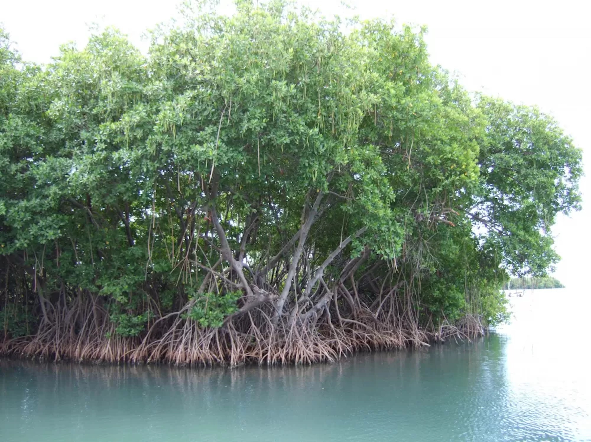
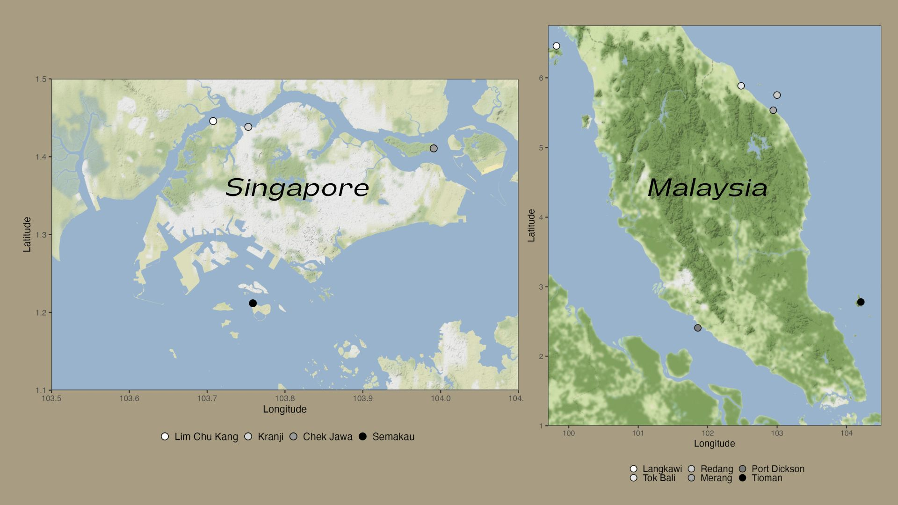
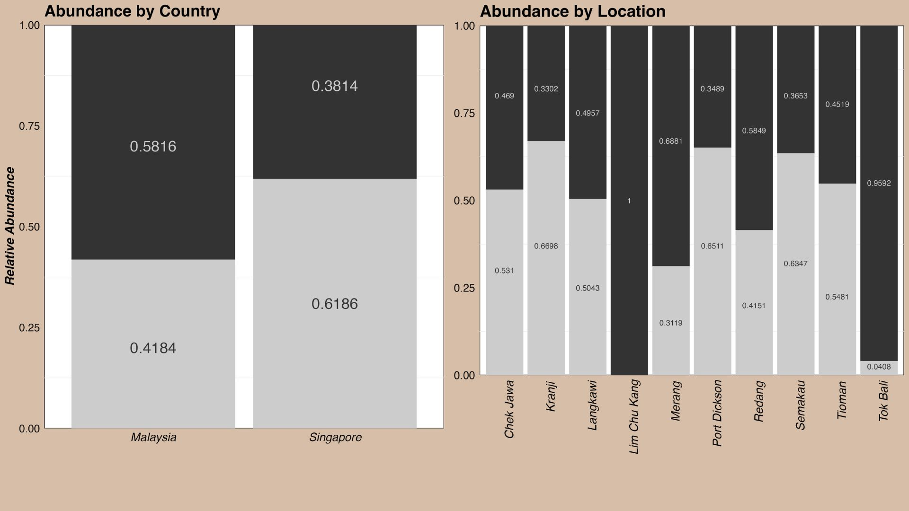

<style type="text/css">
.main-container {
  max-width: 1800px;
  margin-left: auto;
  margin-right: auto;
}
</style>

<style>
  body { background-color: #333333; }
</style>

<style>
div.brown { text-align:center; background-color:#a89d82; border-radius: 10px; padding: 10px;}
</style>
<div class = "brown">

## [Home](http://JLEON123.github.io) | [About Me](https://JLEON123.github.io/aboutme/index.html) | [Portfolio](http://JLEON123.github.io/portfolio/index.html)

</div>

<br>

<style>
div.white { color:#000000; background-color:#ffffff; border-radius: 20px; padding: 20px;}
</style>
<div class = "white">


# **Mangrove Microbiome Analysis**  

___


```{r setup, include=FALSE}
knitr::opts_chunk$set(echo = TRUE, warning = FALSE, message = FALSE, fig.align = 'center')
# Loading Libraries
library(tidyverse)
library(dada2)
library(purrr)
library(Biostrings)
library(ShortRead)
library(ggmap)
library(kableExtra)


# Setting the theme
theme_set(theme_minimal())
```

```{r, echo=FALSE,fig.align='default', fig.cap='*Mangroves are found in salty aquatic areas. They provide food and habitat for many organisms including birds, fish, and microbes. They also play a major role in the carbon cycle.                                           Reference photo: https://ocean.si.edu/ocean-life/plants-algae/mangroves-photos-plants-and-animals*'}

```


## __Introduction__
Introduce the project

___

### *Libraries Used*
```{r, echo=FALSE}
# Creating two vectors, one with the library name and another with it's version
Library <- c("R", "tidyverse", "dada2", "purrr", "Biostrings", "ShortRead", "ggmap", 'kableExtra')
Version <- c("4.1.1", '1.3.2', '1.20.0', '0.3.5', '2.60.2', '1.50.0', '3.0.1', '1.3.4')
# Combining the two vectors to make a data frame to display
Lib_versions <- data.frame(Library, Version)
Lib_versions %>% kable() %>% kable_minimal(lightable_options = 'striped')
```

### *Input Data*
The data used in this project was retrieved from this [github repository](https://github.com/gzahn/SE_Asia_Mangrove_Bacteria). The data was organized by joins and by using tidy conventions to make the following data frame which focuses on biological and geo-spatial attributes.
```{r}
# Reading in data
Df <- readRDS('./data/bact_and_fungi_clean_ps_object')

# Sub-setting the sam_data (sample data)
sam_data <- Df@sam_data %>% 
  as('data.frame') %>% 
  select(Host, Structure, Microbe, geo_loc_name, Location, Lat, Lon) %>% 
  filter(!is.na(Lat), # Removing any rows where latitude and/or longitude data is NA
         !is.na(Lon)) # Original had 478 rows. Six were removed, final has 472 rows.

# Sub-setting the OTU (Operational Taxonomic Unit) and Tax (taxonomy) tables
otu <- Df@otu_table@.Data
tax <- Df@tax_table@.Data

# Changing the row names to a column
sam_data <- rownames_to_column(sam_data, "SampleID") %>% as_tibble()

otu <- as.data.frame(otu) # Originally a matrix
otu <- rownames_to_column(otu, "SampleID") %>% as_tibble()

tax <- as.data.frame(tax) # Originally a matrix
tax <- rownames_to_column(tax, "Read") %>% as_tibble()

# Tidying the otu table
otu <- otu %>% 
  pivot_longer(cols = -'SampleID',
               names_to = 'Read',
               values_to = 'Count')

# Joining the tax and otu dataframes and then joining that dataframe to the sam_data dataframe
tax_otu <- full_join(tax, otu)
full <- full_join(tax_otu, sam_data)

# Removing the 'blanks' found in 9,318 of 742,334 observations
# Remaining observations 733,016 (98.74% of original)
full <- full %>% 
  filter(Structure != 'Blank')

# Sub-setting the full data to display a small portion
full_glimpse1 <- 
  full %>% 
  select(SampleID, Host, Location, Structure, Kingdom, Lat, Lon) %>% 
  head(100)
full_glimpse2 <- 
  full %>% 
  select(SampleID, Host, Location, Structure, Kingdom, Lat, Lon) %>% 
  tail(100)
full_glimpse <- full_join(full_glimpse1, full_glimpse2)

full_glimpse %>% kable() %>% 
  kable_minimal(lightable_options = 'hover') %>% 
  scroll_box(width = "800px", height = "400px")
```

### *Study Area*
The mangrove samples were taken from areas in South-East Asia, specifically, the countries of Malaysia and Singapore.
```{r, include=FALSE}
# Getting just the geo-spatial data
loc_table <- sam_data %>% 
  select(c(geo_loc_name,Location,Lon, Lat))

# Filling the cells with empty values to the correct country.
S_Location <- c("Kranji", "Lim Chu Kang", "Semakau", "Chek Jawa")
loc_table <- loc_table %>% 
  mutate(Country = geo_loc_name,
         .keep = "unused",
         .before = 1) %>% 
  mutate(Country = if_else(loc_table$Location %in% S_Location, "Singapore", "Malaysia"))

# Converting the country and location to factors
loc_table$Location <- as.factor(loc_table$Location)
loc_table$Country <- as.factor(loc_table$Country)

# Getting just the individual points for the locations in Singapore
S_loc_table <- loc_table %>% 
  filter(Country == "Singapore")
S_loc_table <- S_loc_table %>% 
  unique()

S_loc_table$Lon <- as.character(S_loc_table$Lon)
S_loc_table <- S_loc_table %>% filter(Lon != 103.767778) # Removing an incorrect(?) coordinate for Lim Chu Kang
S_loc_table$Lon <- as.numeric(S_loc_table$Lon)
S_loc_table$Location <- factor(S_loc_table$Location, levels = c("Lim Chu Kang", "Kranji", "Chek Jawa", "Semakau"))

# Getting just the individual points for the locations in Malaysia
M_loc_table <- loc_table %>% 
  filter(Country != "Singapore")
M_loc_table <- M_loc_table %>% 
  unique()

M_loc_table$Lon <- as.character(M_loc_table$Lon)
M_loc_table <- M_loc_table %>% filter(Lon != 103.991095) # Removing an incorrect(?) coordinate for Tioman
M_loc_table$Lon <- as.numeric(M_loc_table$Lon)
M_loc_table$Location <- factor(M_loc_table$Location, levels = c("Langkawi", "Tok Bali", "Redang", "Merang", "Port Dickson", "Tioman"))
```

```{r, echo=FALSE}
# Creating a map of Singapore using ggmap and stamen maps
map_singapore <- 
  ggmap(get_stamenmap(bbox = c(103.5,1.1,104.1,1.5), 
                      zoom = 12, 
                      maptype = 'terrain-background')) +
  geom_point(data = S_loc_table,
             aes(x = Lon, y = Lat, fill = Location), 
             size = 5, 
             shape = 21) +
  scale_fill_grey(start = 1, end = 0) +
  theme_bw() +
  theme(legend.position = 'bottom',
        legend.title = element_blank(),
        legend.text = element_text(size = 12),
        axis.title = element_text(size = 12), 
        axis.text = element_text(size = 9),
        plot.background = element_rect(fill = '#a89d82', color = '#a89d82'),
        legend.key.size = unit(.3, "cm"),
        legend.background = element_rect(fill = '#a89d82'),
        legend.key = element_rect(fill = '#a89d82')) +
  labs(x = 'Longitude',
       y = 'Latitude')

# Creating the map for Malaysia using similar settings as the Singapore map
map_malaysia <- 
  ggmap(get_stamenmap(bbox = c(99.7,1.0,104.5,6.75), 
                      zoom = 9, 
                      maptype = 'terrain-background')) +
  geom_point(data = M_loc_table,
             aes(x = Lon, y = Lat, fill = Location), 
             size = 6, 
             shape = 21) + 
  geom_rect(aes(xmin = 103.55, xmax = 104.05, 
                ymin = 1.15, ymax = 1.475), 
                color = 'black', fill = '#EE2536', alpha = 0.1,show.legend = FALSE) +
  scale_fill_grey(start = 1, end = 0) +
  theme_bw() +
  theme(legend.position = 'bottom',
        legend.title = element_blank(),
        legend.text = element_text(size = 12),
        axis.title = element_text(size = 12), 
        axis.text = element_text(size = 9),
        plot.background = element_rect(fill = '#a89d82', color = '#a89d82'),
        legend.key.size = unit(.3, "cm"),
        legend.background = element_rect(fill = '#a89d82'),
        legend.key = element_rect(fill = '#a89d82')) +
  labs(x = 'Longitude', y = 'Latitude')
```

```{r, echo=FALSE}
# Saving the maps so that I can easily format them in an outside software (Canva)
# ggsave('./media/map_of_singapore.jpg',plot = map_singapore,device = 'jpeg',dpi = 300)
#ggsave('./media/map_of_malaysia.jpg',plot = map_malaysia,device = 'jpeg',dpi = 300)

```
___

## **Analyses**
Doing analysis stuff

### *Exploring the Data*
To begin, I want to see if I can find any trends in the data. I'll start by comparing the abundance of bacteria to fungi in the samples based on three predicting variables.   
  **1. The species of the mangrove (*Avicennia alba* or *Sonneratia alba*)**  
  **2. The plant structure of the collected sample (Fruit, Leaf, Pneumatophore, or Sediment)**  
  **3a. The country the sample was collected from**  
  **3b. The specific location the sample was collected from (See maps above)**
```{r}
# Only showing the code for the Species abundance plot! #
# The other two are very similar #

### Comparing Species Microbial Abundances ###
# Finding the count of all reads for bacteria
bact_species_count <- full %>% 
  filter(Kingdom == 'Bacteria') %>% 
  group_by(Host) %>% 
  summarize(Total = sum(Count),
            Kingdom = Kingdom) %>%  unique.data.frame()

# Finding the count of all reads for for fungi
fungi_species_count <- full %>% 
  filter(Kingdom == 'Fungi') %>% 
  group_by(Host) %>% 
  summarize(Total = sum(Count),
            Kingdom = Kingdom) %>%  unique.data.frame()

# Joining the fungi and bacteria tables
fb_species_counts <- full_join(bact_species_count, fungi_species_count)

# Finding the total count
full_species <- full %>% 
  group_by(Host) %>%
  summarize(Kingdom = Kingdom,
            OVR_Total = sum(Count)) %>%  
  unique()

# Joining the overall counts with the bacteria and fungi counts
full_species <- full_join(full_species, fb_species_counts)

# Creating a column for abundance
full_species <- full_species %>%
  mutate(Abundance = Total/OVR_Total)

# Plotting the data
Species_abundance_plot <- full_species %>% 
  ggplot(aes(fill=Kingdom, y=Abundance, x=Host)) + 
  geom_bar(position="fill", stat="identity", show.legend = FALSE)
# Adding the abundance numbers to the chart
SAP2 <- Species_abundance_plot + 
  geom_text(data = full_species %>% filter(Host == 'Avicennia alba' 
                                           & Kingdom == 'Bacteria'),
            aes(x = Host, y = 0.7, label = round(Abundance, 4)),
            color = '#cccccc', size = 6, face = "bold") +
  geom_text(data = full_species %>% filter(Host == 'Avicennia alba' 
                                           & Kingdom == 'Fungi'),
            aes(x = Host, y = 0.2, label = round(Abundance, 4)),
            color = '#333333', size = 6, face = "bold") +
  geom_text(data = full_species %>% filter(Host == 'Sonneratia alba' 
                                           & Kingdom == 'Bacteria'),
            aes(x = Host, y = 0.75, label = round(Abundance, 4)),
            color = '#cccccc', size = 6, face = "bold") +
  geom_text(data = full_species %>% filter(Host == 'Sonneratia alba' 
                                           & Kingdom == 'Fungi'),
            aes(x = Host, y = 0.25, label = round(Abundance, 4)),
            color = '#333333', size = 6, face = "bold")
# Making the plot pretty
Final_SAP <- SAP2 +
  labs(y = 'Relative Abundance', title = 'Abundance by Species') +
  theme(panel.grid.major = element_blank(),
        panel.background = element_rect(fill = 'white'),
        plot.background = element_rect(fill = '#a89d82', color = '#a89d82'),
        plot.title = element_text(size = 19, face = "bold"),
        axis.title.y = element_text(size = 15, color = 'black', face = "bold.italic"),
        axis.title.x = element_blank(),
        axis.text.y = element_text(size = 13, color = 'black'),
        axis.text.x = element_text(size = 12, color = 'black', face = "italic")) +
  scale_y_continuous(expand = c(0, 0)) + # Removes extra space between axes and bars
  scale_fill_grey()
```

```{r, echo=FALSE}
### Comparing Plant Structure Microbial Abundances ###
bact_struct_count <- full %>% 
  filter(Kingdom == 'Bacteria') %>% 
  group_by(Structure) %>% 
  summarize(Total = sum(Count),
            Kingdom = Kingdom) %>%  unique.data.frame()
fungi_struct_count <- full %>% 
  filter(Kingdom == 'Fungi') %>% 
  group_by(Structure) %>% 
  summarize(Total = sum(Count),
            Kingdom = Kingdom) %>%  unique.data.frame()
fb_struct_counts <- full_join(bact_struct_count, fungi_struct_count)


full_structure <- full %>% 
  group_by(Structure) %>%
  summarize(Kingdom = Kingdom,
            OVR_Total = sum(Count)) %>%  
  unique()

full_structure <- full_join(full_structure, fb_struct_counts)

full_structure <- full_structure %>% 
  mutate(Abundance = Total/OVR_Total)

Structure_abundance_plot <- full_structure %>% 
  ggplot(aes(fill = Kingdom, y = Abundance, x = Structure)) + 
  geom_bar(position = "fill", stat = "identity", show.legend = FALSE)

STAP2 <- Structure_abundance_plot +
  geom_text(data = full_structure %>% filter(Structure == 'Fruit' 
                                           & Kingdom == 'Bacteria'),
            aes(x = Structure, y = 0.7, label = round(Abundance, 4)),
            color = '#cccccc', size = 6, face = "bold") +
  geom_text(data = full_structure %>% filter(Structure == 'Fruit' 
                                           & Kingdom == 'Fungi'),
            aes(x = Structure, y = 0.25, label = round(Abundance, 4)),
            color = '#333333', size = 6, face = "bold") +
  geom_text(data = full_structure %>% filter(Structure == 'Leaf' 
                                           & Kingdom == 'Bacteria'),
            aes(x = Structure, y = 0.85, label = round(Abundance, 4)),
            color = '#cccccc', size = 6, face = "bold") +
  geom_text(data = full_structure %>% filter(Structure == 'Leaf' 
                                           & Kingdom == 'Fungi'),
            aes(x = Structure, y = 0.35, label = round(Abundance, 4)),
            color = '#333333', size = 6, face = "bold") +
  geom_text(data = full_structure %>% filter(Structure == 'Pneumatophore' 
                                           & Kingdom == 'Bacteria'),
            aes(x = Structure, y = 0.65, label = round(Abundance, 4)),
            color = '#cccccc', size = 6, face = "bold") +
  geom_text(data = full_structure %>% filter(Structure == 'Pneumatophore' 
                                           & Kingdom == 'Fungi'),
            aes(x = Structure, y = 0.15, label = round(Abundance, 4)),
            color = '#333333', size = 6, face = "bold") +
  geom_text(data = full_structure %>% filter(Structure == 'Sediment' 
                                           & Kingdom == 'Bacteria'),
            aes(x = Structure, y = 0.68, label = round(Abundance, 4)),
            color = '#cccccc', size = 6, face = "bold") +
  geom_text(data = full_structure %>% filter(Structure == 'Sediment' 
                                           & Kingdom == 'Fungi'),
            aes(x = Structure, y = 0.18, label = round(Abundance, 4)),
            color = '#333333', size = 6, face = "bold")
  
Final_STAP <- STAP2 +
  labs(title = 'Abundance by Structure') +
  theme(panel.grid.major = element_blank(),
        plot.title = element_text(size = 19, face = "bold"),
        axis.title.y = element_blank(),
        axis.title.x = element_blank(),
        axis.text.y = element_blank(),
        axis.text.x = element_text(size = 12, color = 'black', face = "italic"),
        plot.background = element_rect(fill = '#a89d82', color = '#a89d82'),
        panel.background = element_rect(fill = 'white')) +
  scale_y_continuous(expand = c(0, 0)) + # Removes extra space between axes and bars
  scale_fill_grey()


### Comparing Location Microbial Abundances ###
bact_loc_count <- full %>% 
  filter(Kingdom == 'Bacteria') %>% 
  group_by(Location) %>% 
  summarize(Total = sum(Count),
            Kingdom = Kingdom) %>%  unique.data.frame()

fungi_loc_count <- full %>% 
  filter(Kingdom == 'Fungi') %>% 
  group_by(Location) %>% 
  summarize(Total = sum(Count),
            Kingdom = Kingdom) %>%  unique.data.frame()

fb_loc_counts <- full_join(bact_loc_count, fungi_loc_count)

full_loc <- full %>% 
  group_by(Location) %>%
  summarize(Kingdom = Kingdom,
            OVR_Total = sum(Count)) %>%  
  unique()

full_loc <- full_join(full_loc, fb_loc_counts)

full_loc <- full_loc %>%
  mutate(Abundance = Total/OVR_Total)

Location_abundance_plot <- full_loc %>% 
  ggplot(aes(fill=Kingdom, y=Abundance, x=Location)) + 
  geom_bar(position="fill", stat="identity", show.legend = FALSE)


LAP2 <- Location_abundance_plot +
  geom_text(data = full_loc %>% filter(Location == 'Chek Jawa' 
                                           & Kingdom == 'Bacteria'),
            aes(x = Location, y = 0.8, label = round(Abundance, 4)),
            color = '#cccccc', size = 3, face = "bold") +
  geom_text(data = full_loc %>% filter(Location == 'Chek Jawa' 
                                           & Kingdom == 'Fungi'),
            aes(x = Location, y = 0.3, label = round(Abundance, 4)),
            color = '#333333', size = 3, face = "bold") +
  geom_text(data = full_loc %>% filter(Location == 'Kranji'
                                           & Kingdom == 'Bacteria'),
            aes(x = Location, y = 0.82, label = round(Abundance, 4)),
            color = '#cccccc', size = 3, face = "bold") +
  geom_text(data = full_loc %>% filter(Location == 'Kranji' 
                                           & Kingdom == 'Fungi'),
            aes(x = Location, y = 0.37, label = round(Abundance, 4)),
            color = '#333333', size = 3, face = "bold") +
  geom_text(data = full_loc %>% filter(Location == 'Langkawi' 
                                           & Kingdom == 'Bacteria'),
            aes(x = Location, y = 0.75, label = round(Abundance, 4)),
            color = '#cccccc', size = 3, face = "bold") +
  geom_text(data = full_loc %>% filter(Location == 'Langkawi' 
                                           & Kingdom == 'Fungi'),
            aes(x = Location, y = 0.25, label = round(Abundance, 4)),
            color = '#333333', size = 3, face = "bold") +
  geom_text(data = full_loc %>% filter(Location == 'Lim Chu Kang' 
                                           & Kingdom == 'Bacteria'),
            aes(x = Location, y = 0.5, label = round(Abundance, 4)),
            color = '#cccccc', size = 3, face = "bold") +
  geom_text(data = full_loc %>% filter(Location == 'Merang' 
                                           & Kingdom == 'Bacteria'),
            aes(x = Location, y = 0.67, label = round(Abundance, 4)),
            color = '#cccccc', size = 3, face = "bold") +
  geom_text(data = full_loc %>% filter(Location == 'Merang' 
                                           & Kingdom == 'Fungi'),
            aes(x = Location, y = 0.15, label = round(Abundance, 4)),
            color = '#333333', size = 3, face = "bold") +
  geom_text(data = full_loc %>% filter(Location == 'Port Dickson' 
                                           & Kingdom == 'Bacteria'),
            aes(x = Location, y = 0.82, label = round(Abundance, 4)),
            color = '#cccccc', size = 3, face = "bold") +
  geom_text(data = full_loc %>% filter(Location == 'Port Dickson' 
                                           & Kingdom == 'Fungi'),
            aes(x = Location, y = 0.37, label = round(Abundance, 4)),
            color = '#333333', size = 3, face = "bold") +
  geom_text(data = full_loc %>% filter(Location == 'Redang' 
                                           & Kingdom == 'Bacteria'),
            aes(x = Location, y = 0.7, label = round(Abundance, 4)),
            color = '#cccccc', size = 3, face = "bold") +
  geom_text(data = full_loc %>% filter(Location == 'Redang' 
                                           & Kingdom == 'Fungi'),
            aes(x = Location, y = 0.2, label = round(Abundance, 4)),
            color = '#333333', size = 3, face = "bold") +
  geom_text(data = full_loc %>% filter(Location == 'Semakau' 
                                           & Kingdom == 'Bacteria'),
            aes(x = Location, y = 0.8, label = round(Abundance, 4)),
            color = '#cccccc', size = 3, face = "bold") +
  geom_text(data = full_loc %>% filter(Location == 'Semakau' 
                                           & Kingdom == 'Fungi'),
            aes(x = Location, y = 0.32, label = round(Abundance, 4)),
            color = '#333333', size = 3, face = "bold") +
  geom_text(data = full_loc %>% filter(Location == 'Tioman' 
                                           & Kingdom == 'Bacteria'),
            aes(x = Location, y = 0.775, label = round(Abundance, 4)),
            color = '#cccccc', size = 3, face = "bold") +
  geom_text(data = full_loc %>% filter(Location == 'Tioman' 
                                           & Kingdom == 'Fungi'),
            aes(x = Location, y = 0.225, label = round(Abundance, 4)),
            color = '#333333', size = 3, face = "bold") +
  geom_text(data = full_loc %>% filter(Location == 'Tok Bali' 
                                           & Kingdom == 'Bacteria'),
            aes(x = Location, y = 0.55, label = round(Abundance, 4)),
            color = '#cccccc', size = 3, face = "bold") +
  geom_text(data = full_loc %>% filter(Location == 'Tok Bali' 
                                           & Kingdom == 'Fungi'),
            aes(x = Location, y = 0.025, label = round(Abundance, 4)),
            color = '#333333', size = 3, face = "bold")

Final_LAP <- LAP2 + 
  labs(title = 'Abundance by Location') +
  theme(panel.grid.major = element_blank(),
        axis.title.y = element_blank(),
        plot.title = element_text(size = 18, face = "bold"),
        axis.text.y = element_text(size = 12, color = 'black'),
        axis.title.x = element_blank(),
        axis.text.x = element_text(size = 13, color = 'black', angle = 90, 
                                   hjust = 0.95, face = "italic"),
        plot.background = element_rect(fill = '#a89d82', color = '#a89d82'),
        panel.background = element_rect(fill = 'white')) +
  scale_y_continuous(expand = c(0, 0)) + # Removes extra space between axes and bars
  scale_fill_grey()

### Comparing Country Microbial Abundances ###
bact_country_count <- full %>% 
  filter(Kingdom == 'Bacteria',
         !is.na(geo_loc_name)) %>% 
  group_by(geo_loc_name) %>% 
  summarize(Total = sum(Count),
            Kingdom = Kingdom) %>%  unique.data.frame()

fungi_country_count <- full %>% 
  filter(Kingdom == 'Fungi',
         !is.na(geo_loc_name)) %>% 
  group_by(geo_loc_name) %>% 
  summarize(Total = sum(Count),
            Kingdom = Kingdom) %>%  unique.data.frame()

fb_country_counts <- full_join(bact_country_count, fungi_country_count)

full_country <- full %>% 
  group_by(geo_loc_name) %>%
  summarize(Kingdom = Kingdom,
            OVR_Total = sum(Count)) %>%  
  unique() %>% 
  filter(!is.na(geo_loc_name))

full_country <- full_join(full_country, fb_country_counts)

full_country <- full_country %>%
  mutate(Abundance = Total/OVR_Total)

Country_abundance_plot <- full_country %>% 
  ggplot(aes(fill=Kingdom, y=Abundance, x=geo_loc_name)) + 
  geom_bar(position="fill", stat="identity", show.legend = FALSE)

CAP2 <- Country_abundance_plot +
  geom_text(data = full_country %>% filter(geo_loc_name == 'Malaysia' 
                                           & Kingdom == 'Bacteria'),
            aes(x = geo_loc_name, y = 0.7, label = round(Abundance, 4)),
            color = '#cccccc', size = 6, face = "bold") +
  geom_text(data = full_country %>% filter(geo_loc_name == 'Malaysia' 
                                           & Kingdom == 'Fungi'),
            aes(x = geo_loc_name, y = 0.2, label = round(Abundance, 4)),
            color = '#333333', size = 6, face = "bold") +
  geom_text(data = full_country %>% filter(geo_loc_name == 'Singapore'
                                           & Kingdom == 'Bacteria'),
            aes(x = geo_loc_name, y = 0.85, label = round(Abundance, 4)),
            color = '#cccccc', size = 6, face = "bold") +
  geom_text(data = full_country %>% filter(geo_loc_name == 'Singapore' 
                                           & Kingdom == 'Fungi'),
            aes(x = geo_loc_name, y = 0.31, label = round(Abundance, 4)),
            color = '#333333', size = 6, face = "bold")

Final_CAP <- CAP2 + 
  labs(title = 'Abundance by Country',
       y = 'Relative Abundance') +
  theme(panel.grid.major = element_blank(),
        axis.title.y = element_text(size = 14, color = 'black', face = "bold.italic"),
        plot.title = element_text(size = 18, face = "bold"),
        axis.text.y = element_text(size = 12, color = 'black'),
        axis.title.x = element_blank(),
        axis.text.x = element_text(size = 13, color = 'black',face = "italic"),
        plot.background = element_rect(fill = '#a89d82', color = '#a89d82'),
        panel.background = element_rect(fill = 'white')) +
  scale_y_continuous(expand = c(0, 0)) + # Removes extra space between axes and bars
  scale_fill_grey()

```

```{r, echo=FALSE}
# Saving all plots to format in Canva #
#ggsave(filename = './media/Species_abundance.jpg',plot = Final_SAP, device = 'jpeg',dpi = 300)
#ggsave(filename = './media/Structure_abundance.jpg',plot = Final_STAP, device = 'jpeg',dpi = 300)
#ggsave(filename = './media/Location_abundance.jpg',plot = Final_LAP, device = 'jpeg',dpi = 300)
#ggsave(filename = './media/Country_abundance.jpg',plot = Final_CAP, device = 'jpeg',dpi = 300)

knitr::include_graphics('./media/Abundance_graphs.jpg')

```

From these plots, it appears that the microbial abundance is affected by all three predicting variables. However, using a general linearized model, we can see that...

```{r}
## Creating models based on each predictor plotted above ##

# Model data #
Host_Data <- full %>% 
  group_by(Host) %>% 
  summarize(Count = Count,
            Total = sum(Count),
            Abundance = Count/Total,
            Kingdom = Kingdom)

# Kingdom as a function of Host species
Species_model <- glm(data = Host_Data,
                     formula = Kingdom ~ Host)

Species_mod <- Host_Data %>% 
  mutate(Fungi = case_when(Kingdom == 'Fungi' ~ TRUE,
                                  TRUE ~ FALSE)) %>% 
  glm(data = ., 
      formula = Fungi ~ Host,
      family = "binomial")
```

# Vegan package
adonis2


adonis2(otu_table(ps) ~ Island * LAt * whatever)

on relative abundance transformed data


